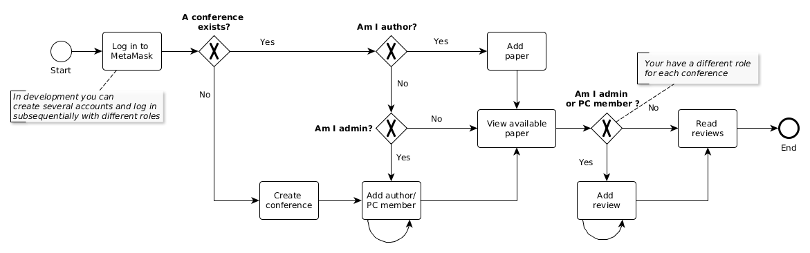

# FakeChair - Bachelor thesis Project

A conference management and review tool on the Ethereum testnet Rinkeby. 
There are two ways to use this app:

1. [Deploy locally](#prerequisites-for-local-development)
2. [Access the live demo](#live-demo)

## Getting Started

These instructions will get you a copy of the project up and running on your local machine for development and testing purposes. See deployment for notes on how to deploy the project on a live system.


### Prerequisites for local development

What things you need to install the software and how to install them.

Get the project:

```
$ git clone https://gitlab.gwdg.de/f.buschendorf/fakechair 
```

This Project uses the node packet manager:

```
$ sudo apt-get install npm 
```
The dapp is build using the dapp framework *Truffle*:

```
$ npm install -g truffle 
```

Install MetaMask, a browser add-on to interact with an Ethereum blockchain via dapps:

* [MetaMask](https://metamask.io/)


Download and install Ganache, a local Ethereum blockchain:

* [Ganache](http://truffleframework.com/ganache/)

Download and install IPFS, a peer-to-peer file storage system:

* [IPFS](https://ipfs.io/docs/getting-started/)

Go into the project folder, you will find `package.json`. Install all dependencies. npm will look at the dependencies that are listed in that file and download the latest versions.

```
$ npm install
```

## Run dapp local

Start Ganache on port `7545`.

Start IPFS daemon:

```
$ ipfs daemon 
```

**In project folder**: Compile and migrate contracts to the local blockchain:

```
$ truffle migrate --reset 
```

Run node:

```
$ npm run start 
```

Log in to MetaMask: copy the mnemonic from Ganache UI and import it to MetaMask. This will enable the accounts generated by Ganache (see [Truffle Pet-Shop tutorial](http://truffleframework.com/tutorials/pet-shop)). Set MetaMask to the local rpc server: `http://127.0.0.1:7545`

In your browser the dapp should now be running and working. 

## Usage Workflow



See: [Business Process Model and Notation](https://de.wikipedia.org/wiki/Business_Process_Model_and_Notation)

### Running the tests

There are only a few automated tests for this system, which are not up-to-date.

```
$ truffle test
```

## Remote Deployment

This dapp is deployed on the Rinkeby testnet.
### Deploy contracts to testnet
A full description on how to deploy it on an Ethereum testnet like Rinkeby can be found [here](http://truffleframework.com/tutorials/deploying-to-the-live-network). However, I added a few details:

First, you need to download the whole Rinkeby blockchain. **This can take hours!** Let it run over night. For deployment, `truffle.js` assumes an open [RPC](https://ethereumbuilders.gitbooks.io/guide/content/en/ethereum_json_rpc.html) endpoint running on on localhost, port `8546`: 

```
 $ geth --rinkeby --rpc --rpcport 8546
```

If the blockchain is synchronised, calling `eth.syncing` in the geth console returns `true` (Ubuntu)

```
$ geth --datadir=$HOME/.rinkeby attach ipc:$HOME/.ethereum/rinkeby/geth.ipc console
Welcome to the Geth JavaScript console!

instance: Geth/v1.8.2-stable-b8b9f7f4/linux-amd64/go1.9.4
coinbase: 0x2c0a8be92c61efa92edb1dc478a58ee2a0e07eb1
at block: 2420815 (Thu, 07 Jun 2018 16:38:24 CEST)
 datadir: /home/fabiola/.ethereum/rinkeby
 modules: admin:1.0 clique:1.0 debug:1.0 eth:1.0 miner:1.0 net:1.0 personal:1.0 rpc:1.0 txpool:1.0 web3:1.0

> eth.syncing
true
```
Migrate the contracts to this network:

```
$ truffle migrate --network live
```

The contracts are now accessible via Rinkeby.

### Build UI source code

This project is build with webpack. To build a compressed production version, run

```
$ npm run build
```
This will create the folder `build_webpack/` with a single `index.html` file and a `/static` folder containing a minified .css and .js file. Put this content on a webserver. 

## Live Demo

A live demo is available at [fakechair.fabiolabuschendorf.de](http://fakechair.fabiolabuschendorf.de) 

This dapp is migrated to the Rinkeby testnet. Log in to **MetaMask** in your browser, select the Network Rinkeby and create an account with some test-ether (generate them in the [faucet](https://www.rinkeby.io/)). Files hosted on IPFS are accessed via a public gateway `https://ipfs.io/ipfs/HASH`. It might take some time to retrieve contents from the public gateway. To create content, you need to run an own IPFS node in your terminal:

```
$ ipfs daemon
```


## Built With

* [Solidity](http://solidity.readthedocs.io/en/v0.4.24/) - Smart Contract programming language for Ethereum
* [react-js](https://reactjs.org/docs/hello-world.html) - The web framework used
* [npm](https://www.npmjs.com/) - Packet manager for JavaScript
* [truffle](http://truffleframework.com/) - Development framework for Ethereum (based on *react-box*)
* [web3.js](https://web3js.readthedocs.io/en/1.0/getting-started.html) - JavaScript library for Ethereum contract interaction
* [Bootstrap v4](https://getbootstrap.com/) - Front-end component library
* [react-jsonschema-form](https://github.com/mozilla-services/react-jsonschema-form) - Creating forms from JSON schemas
* [webpack](https://webpack.js.org/) -  a static module bundler for JavaScript applications


## Authors

* **Fabiola Buschendorf** [My Homepage](http://fabiolabuschendorf.com)


## License

GNU GPLv3 


## Some Code Sources

* [Origin Protocol](https://github.com/OriginProtocol/origin-js) - Well written Ethereum dapp
* [eth-ipfs](https://github.com/mcchan1/eth-ipfs) - Uploading files to IPFS + Ethereum + react
* [Truffle - Pet Shop](http://truffleframework.com/tutorials/pet-shop) - Getting started with truffle and smart contracts
* [ES6 - JavaScript Improves](https://de.udacity.com/course/es6-javascript-improved--ud356) - Udacity Tutorial on promises, async/await, ...
* [OpenZeppelin](https://github.com/OpenZeppelin/openzeppelin-solidity) - OpenZeppelin, a framework to build secure smart contracts on Ethereum (RBAC)
* [Multihash](https://github.com/multiformats/multihash) - hash format used by IPFS

